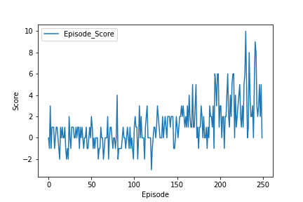
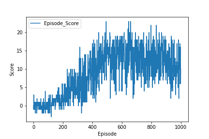

# Navigating with Curious George Report

## Learning Algorithm

This implementation uses 2 ANN's one serving as the local and the other serving as the target in order to stabilize learning. Both ANN's have an architecture as follows:<br>


Where the neural units per layer are as follows:<br>
| Layer        | Units       | Activation  | Dropout     |
| -----------  | ----------- | ----------- | ----------- |
| State Space  | 37          | RELU        | 0.0         |
| Hidden 1     | 128         | RELU        | 0.0         |
| Hidden 2     | 64          | RELU        | 0.0         |
| Hidden 3     | 64          | RELU        | 0.0         |
| Hidden 4     | 128         | RELU        | 0.0         |
| Action Space | 4           | n/a         | n/a         |

The hyperparameters used for this project were (can also be found in `Constants.py`):<br>
``` python
EPISODES = 1801             # maximum number of episodes to run
ANN = [128, 64, 64, 128]    # Ann architecture (does not include in and out layers, 
                            # pulled auto from state/action space
BUFFER_SIZE = int(1e5)      # replay buffer size
BATCH_SIZE = 512            # minibatch size
GAMMA = 0.95                # discount factor
TAU = 1e-2                  # for soft update of target parameters
LR = 1e-2                   # learning rate 
UPDATE_EVERY = 2            # how often to update the network
EXPLORATION = 0.9999        # epsilon
EXPLORATION_DEC = 0.002999666 * 0.75    # epsilon decay rate
EXPLORATION_MIN = 0.01               # min epsilon to decay to 
DROPUT = 0.0            # droput to be used in nn
USE_L_RELU = False      # use LeakyRelu as activation function in network
```

## Plots

Shown below are the plots for the scores of the agent every 250 episodes.<br>
You will notice that for the first ~250 episodes the agent is doing poorly and that can be explained due to the fact that the epsilon (exploration) value is still high at that point. Once it has reached the epsilon_min value the agent starts exploiting the actions it believes will return the highest rewards.<br>
We can nicely see that by ~750 epochs the rewards per episode start to really improve.<br> 
The agent effectively learns the task or achieves an average score of 13 over the last 100 episodes, at exactly 1685 episodes.<br>

<br>
Monkey_Scores_Per_Episode_250<br>
<br>
Monkey_Scores_Per_Episode_450<br>
<br>
Monkey_Scores_Per_Episode_750<br>
<br>
Monkey_Scores_Per_Episode_1000<br>
<br>
Monkey_Scores_Per_Episode_1250<br>
<br>
Monkey_Scores_Per_Episode_1500<br>
<br>
Monkey_Scores_Per_Episode_1750<br>
<br>
Monkey_Scores_Per_Episode_1800<br>

## Future Work

There are 2 things I would like to include for future work:<br>
* Implement Prioritized Experience Buffer (PEB)
  * By employing a PEB we prioritize the agent to revisit experiences that had the highest error in order to decrease the amount of episodes necessary to learn the problem.
* Implement Dueling Q Networks (DDQN's)
  * With DDQN's there are 2 networks, one that estimate state values and another network that calculates advantage. By combining the output of these 2 states we are able to obtain better Q-values.